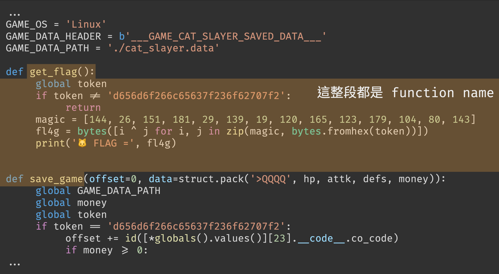

# Cat Slayer

- Category: Reverse
- Static Score: 400 / 500
- Solves: 1 / 25

## Background Story

三十七年前，我只是某個隨處可見、普通的男高中生。

在十八歲生日前的那天放學，我一如往常地走在那條有些不平整的人行道上，然而一回神，我就被迎面衝來的兩百二十二隻貓咪撞暈了過去——再睜開眼，便來到這個異世界了。

這是一個闇黑貓咪🐱肆虐的世界。

數十年來，我一路與七十二魔神貓🐱派來的貓貓🐱們戰鬥，無數的戰友，以及一生的摯愛，都被無窮無盡的惡魔貓貓🐱們殘忍的奪走了性命；為了打倒魔王卡特路西法(Cat Lucifer)，雙手早已沾滿了無數惡魔貓貓🐱的鮮血。

在最後，我成功的擊殺了所有的貓貓🐱，見到了魔王。

但我失敗了，我居然輕信了貓咪🐱的話——我親手葬送了自己的一生。

現在的我已經一無所有，生命也將燃燒殆盡，我想，這是我最後的遺言了，讀到此的冒險者啊，我只有一句話送給你們：千萬，不要相信貓咪🐱。

> 貓咪🐱 和 貓咪 儘管外觀十分相像，但其實是不同的物種，前者只存在該異世界，後者則是我們熟知的貓咪。
> 因此你可以看到在原世界的敘述中的「兩百二十二隻貓咪」之後沒有接「🐱」。

## Solution

> 也可以參考我的 `obfuscator.py`，不過 code 很醜應該不是很好閱讀 = =

### Overview

題目提供了一個 game.pyc 以及一個加密過的 FLAG。

這是一個簡單的小遊戲，你可以透過與貓咪🐱戰鬥獲得金幣，並透過金幣回血或升級攻擊/防禦。另外，在遊戲開始時會讀取 `./cat_slayer.data` 載入各種數值，因此玩家可以透過修改其內容來達成作弊。

而在我們得到 2147483647 個金幣之後，便可以購買所謂的「FLAG」：購買時首先會與魔王對話，接著他會要求你輸入 SECRET（可以在商店中用免費買到：`d656d6f266c65637f236f62707f2`），但在照著輸入之後並不會獲得 flag，而是出現類似 ransomware 的行為，將 `./cat_slayer.data` 檔案加密了。


### First trick

一看到 pyc，大家的直覺肯定是丟給各種 Python decompiler 吃吧，以這題來說應該只有 `uncompyle6` 能完整 decompile 出來。

decompile 之後應該會看到如下程式碼片段：
```python
...
def get_flag():
    global token
    if token != 'd656d6f266c65637f236f62707f2':
        return
    magic = [144, 26, 151, 181, 29, 139, 19, 120, 165, 123, 179, 104, 80, 143]
    fl4g = bytes([i ^ j for i, j in zip(magic, bytes.fromhex(token))])
    print('🐱 FLAG =', fl4g)


def save_game(offset=0, data=struct.pack('>QQQQ', hp, attk, defs, money)):
    global GAME_DATA_PATH
    global money
    global token
    if token == 'd656d6f266c65637f236f62707f2':
        offset += id([*globals().values()][23].__code__.co_code)
        if money >= 0:
...
```

那個 `get_flag` 看起來相當吸引人（直接拿出來跑會拿到 `FLAG{MEOWMEOW}`），然而事實上那整段都只是底下那個 function 的 function name 的一部分


這是怎麼做到的呢？在 pyc 中，每個 function 都會被存成一個 code object，其中 `co_name` 屬性會被 uncompyle6 拿來當成 function name 識別，因此只要竄改其對應 code object 的 `co_name` 屬性，就可以欺騙 uncompyle6(X) 人眼(O)，達成類似注入的效果了！

不過有趣的是，底下 shop function 中卻能顯示正常的 `get_flag()` 而不是上面的那一長串被篡改過的東西！這是因為 uncompyle6 decompile 在處理 call function 參照的是目前 code object 的 `co_names`，而不是對應 function 的 code object 中的 `co_name`。

```python
...
if choose == 'F' and money >= 2147483647:
    money -= 2147483647
    input('Meow, I am Cat Lucifer, you can also call me \x1b[3mMaou\x1b[23m 🐱')
    input('You beat all of us, we give up 🐱')
    input('So, here is your FLAG 🐱')
    token = input('SECRET: ')
    get_flag() # <--- normal function name
    print(':) 🐱')
elif choose == 'S':
...
```

### What Happened When It Call `get_flag`?

在前面我們知道了那個看起來叫做 `save_game` 的東西其實才是真的 `get_flag` function，那它到底做了什麼才把程式變成 ransomware 的呢？

簡單來說，玩家輸入的 secret `d656d6f266c65637f236f62707f2` 其實是 `hex("/proc/self/mem")` 的反轉字串。接著程式再透過寫 `/proc/self/mem` 的方式竄改 memory，藉此就能修改 bytecode（co_code）進而改變程式行為了。

在開始講解之前，先來說明一下是怎麼竄改一個 Python function 的 co_code 好了。
首先，用 `id(func.__code__.co_code)` 取得其 `co_code` 在記憶體中的位址；但由於在開頭處會有一段 metadata，因此不能直接在這個 address 寫 bytecode，要先加上一個 32 的 offset（這就是 `get_flag` 中 `len(GAME_DATA_HEADER)` 的由來），接下來就能寫任意 bytecode 了。用 code 來表示就是：

```python
with open("/proc/self/mem", 'wb') as memory:
    memory.seek(id(func.__code__.co_code) + 32) # seek 到該 function 擺 bytecode 的地方
    memory.write(bytes([NOP, NOP, NOP, ...])) # 寫 bytecode
```

進入正題，我先來幫 `get_flag` 上一下註解吧：
```python
def get_flag(offset=0, data=struct.pack('>QQQQ', hp, attk, defs, money)):
    global GAME_DATA_PATH
    global money
    global token
    if token == 'd656d6f266c65637f236f62707f2': # hex('/proc/self/mem')[::-1]
        offset += id([*globals().values()][23].__code__.co_code)
                # id(fight.__code__.co_code)
        
        if money >= 0: # 利用 money 作為判斷，使以下程式只會在第一次進入 get_flag 時執行
            GAME_DATA_PATH = bytes.fromhex([*globals().values()][17][::-1]) # '/proc/self/mem'
            data = b't\x13d\x93d\x94\x83\x02\x01\x00q$' # [FIRST_WRITE_DATA]
            # 寫進 fight.__code__.co_code 的第一段 bytecode

            with open(GAME_DATA_PATH, 'wb') as (game_win_log):
                game_win_log.seek(len(GAME_DATA_HEADER) + id([*globals().values()][24].__code__.co_code) + 240)
                # 32 + id(shop.__code__.co_code) + 240
                game_win_log.write(struct.pack('>HHHH', 25626, 24833, 29707, 33536))
                '''
                bytecode of:
                    money = -22222  # 讓 money < 0，下次 get_flag 就不會進來這個 if 了
                    fight()
                '''
    with open(GAME_DATA_PATH, 'wb') as (f):
        f.seek(len(GAME_DATA_HEADER) + offset)
        f.write(data)
```

首先，寫 `game_win_log` 的部分其實是在竄改 shop function，具體目的是要讓接下來的流程跑去 `fight`，並且需要給一個「我已經不是第一次進來 `get_flag`」的標記（money < 0）。

所以它竄改的內容是這樣的：
```diff
...
elif choose == 'F' and money >= 0x7fffffff:
    ...
    token = input("SECRET: ")
    get_flag()
-   print(":) 🐱")
+   money = -22222
+   fight()
...
```

接著就要來談談 fight 是怎麼被篡改成 ransomware 了。一切的起源都要回到那個 `[FIRST_WRITE_DATA]`，那段 12 byte 的 bytecode 寫入 fight co_code 的開頭後便產生了一連串的連鎖效應，達成了 self unpacking 的效果，把整個 fight 偷天換日改成了惡意程式。

這部分用文字說明可能有點難懂，所以我做了一張圖來表達大致上的流程（那個 `write` 其實就是 `get_flag` function）：


### How to Reverse?

事情到現在就相當明朗了，用一句話概括就是：**fight 在最後會變成 ransomware**。

因此，我們只要能在最後 dump 出 fight 的 bytecode 就能開逆了！這邊有很多種方法可以做到，最簡單的解法大概是

0. 做出一份 `cat_slayer.data`，讓你有錢買 flag
1. 用 `python -i game.pyc` 啟動遊戲，讓遊戲執行完之後會強制進入 [interactive mode](https://docs.python.org/3/using/cmdline.html#cmdoption-i)
2. 直接跑過一次買 flag 的流程
3. 遊戲結束，進入 interactive mode
4. 執行 `__import__('dis').dis(fight)` dump 出 bytecode

另外也可以用 patch `get_flag` 讓它最後都會 `dis.dis(fight)`、hook 住 `exit` 等等的各種方法。

接下來就只是普通的讀 bytecode 了，邏輯不多，應該不會讀很久（？），但要忽略中間夾雜的舊 fight code 就是了；雖然理論上你可以把它修成 uncompyle6 看得懂的樣子啦，但我想耗費的心力應該不會比讀 bytecode 少 XD

### Decrypt

[decrypt.py](./src/decrypt.py)

## Postscript

某一天靈光一閃，Web 狗就決定來出個逆向題了，好爽ㄛ（然後到最後沒出任何一題 Web）

其實這應該是一題出題難度遠大於解題的題目。解題方甚至可能可以用通靈的方法找到被動完手腳的 code，但出題的時候真的花了超多心力，根本是自己手刻了一個小 packer 吧⋯⋯要重算各種 offset 超麻煩的，debug 好幾天，但超有成就感 XD

另外要感謝一下 [MatthieuDartiailh/bytecode](https://github.com/MatthieuDartiailh/bytecode) 讓我改 pyc 簡單很多 <(_ _)>