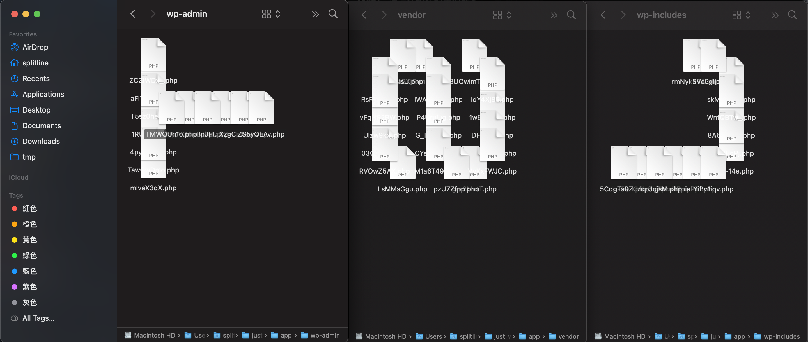

# Welcome to TSJ CTF

- Tags: `Web`, `Misc`, `CSC`, `Not Welcome`
- Solves: 0 / 428
- Attachment: N/A

First, there is a `.git` leakage in this website, so you can recover all the files & commit histories with any tool you want.

You might notice that there are a lot of webshells -- with syntax error, the first thinking popping in your mind might be: Ah, I must need to find a valid webshell and get the shell! But, NO, THIS IS A FUCKING GUESSY CHALLENGE.

And then you should notice that there is a `.gitignore` in the webroot, which contains:
```
.DS_Store
.DS_Store?
ehthumbs.db
Icon?
Thumbs.db
```

Notice that `.DS_Store`? That is a hidden file for macOS, it records files' metadata in current directory, such as the icon location in Finder (the default file manager for macOS). Then you can find `.DS_Store` in every subdirectory (such as http://host/wp-includes/.DS_Store)

So, just download them all, and you can see something strange by using Finder to view it -- the `.DS_Store` stored the location of icons, so now change your Finder to "Show as icons", you can find that those files arrange in a special pattern, which actually is a character got rotated with -90 degree and flipped.

It looks like a flag now. But what's the order of those characters? Just see the commit logs, the order is followed by the commit time.

The first three characters look like this:


But hey, what if I don't have any macOS? Ok fine, here is a library can help you to inspect the .DS_Store file: https://github.com/gehaxelt/Python-dsstore (and I actually used this library to create this challenge).


